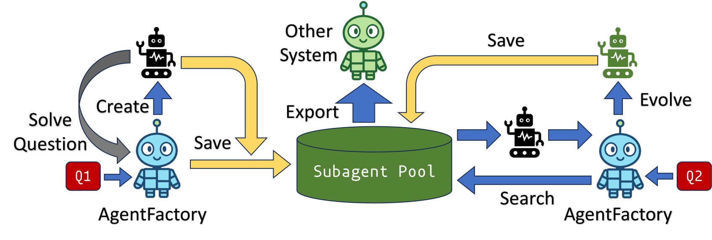
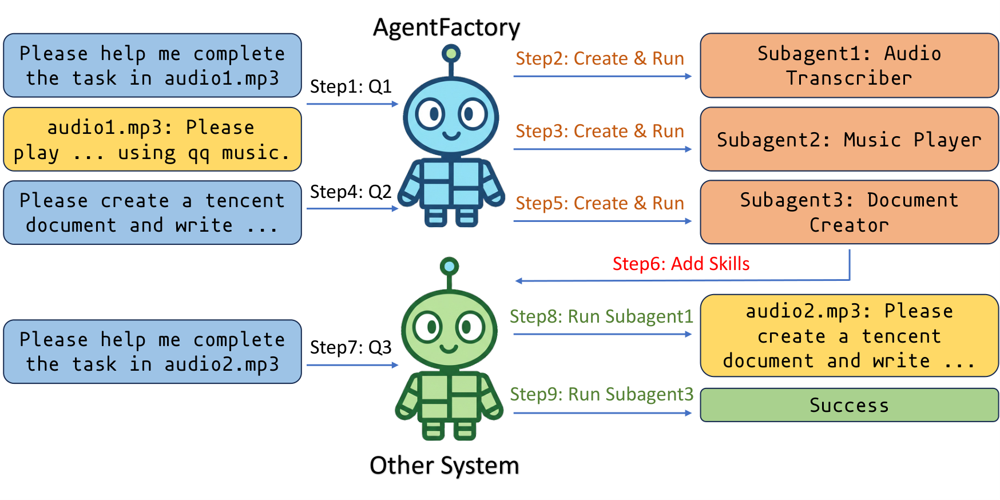
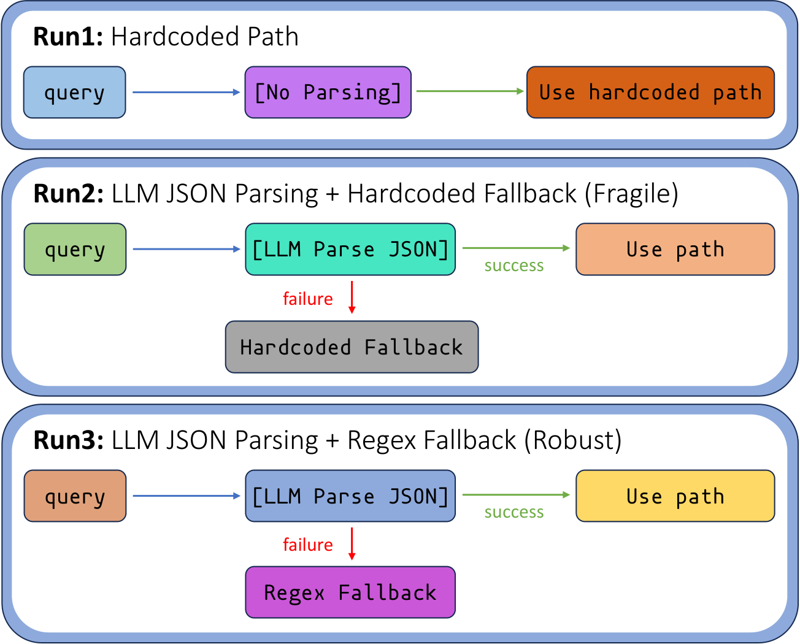

# AgentFactory: A Self-Evolving Framework Through Executable Subagent Accumulation and Reuse

A Meta-Agent system that orchestrates problem-solving by decomposing complex tasks and delegating them to specialized subagents. The system features a self-evolving capability: subagents created during one task can be automatically reused and improved in subsequent tasks.

<p align="center">
  
</p>

## Setup

### 1. Install Dependencies

```bash
conda create -n agentfactory python=3.12
conda activate agentfactory
pip install openai requests playwright flask flask_cors
```

### 2. Configure API Key

Edit `llm.py` and set your API key and model configuration:

```python
# For Claude
LLM_URL_CLAUDE = "https://your-api-endpoint/v1"
LLM_API_KEY_CLAUDE = "your-api-key"
LLM_MODEL_CLAUDE = "claude-opus-4-6"

# For MiniMax (local or remote)
LLM_URL_MINIMAX = "https://your-api-endpoint/v1"
LLM_API_KEY_MINIMAX = "your-api-key"
LLM_MODEL_MINIMAX = "MiniMax-M2.5"
```

Switch between models by changing `model_choice` at the top of `llm.py`.

### 3. Configure Tool API Keys

Edit `tools.py` and set your API keys for web search and page reading:

```python
SERPER_API_KEY = "your-serper-api-key"   # Get from https://serper.dev
JINA_API_KEY = "your-jina-api-key"       # Get from https://jina.ai
```

### 4. Install Chrome

Browser-based tasks (e.g., web automation via Playwright) require Google Chrome. Make sure Chrome is installed on your machine before running these tasks.

### 5. Replace Placeholder Paths

In `data/questions_round1.jsonl` and `data/questions_round2.jsonl`, replace all occurrences of `<Absolute_Path_to_AgentFactory>` with the actual absolute path to this directory. For example:

```txt
<Absolute_Path_to_AgentFactory>/qq_music_taylor.mp3
```

should become:

```txt
/home/user/AgentFactory/qq_music_taylor.mp3
```

## Running Tests

```bash
python run.py --question-file data/questions_round1.jsonl
```

Optional flags:

- `--human-confirm` — pause for human confirmation when finishing
- `--no-save` — do not save subagent skills after completion

## Web Demo

Start the web server:

```bash
python3 web_interface/app.py --port 5050
```

Then open `http://localhost:5050` in your browser. To have the agent solve a task described in an audio file, enter:

```txt
Help me complete a task. The detailed description of the task is in the audio file <your_absolute_path_to_audio>
```

For example, using the included sample audio:

```txt
Help me complete a task. The detailed description of the task is in the audio file /home/user/AgentFactory/tencent_doc_en.mp3
```

Replace the path with the actual absolute path to the audio file on your machine.

## Visualizing Trajectories

Open `visualize_trajectory.html` in a browser, then select a trajectory JSON file to visualize the agent's execution process.

## Recorded Demonstrations

The `trajectory/` directory contains saved execution trajectories that correspond to the demonstrations referenced in the paper:

- **`trajectory/qq_music/`** — Two runs of the QQ Music task.
  - `first_time.json` — First attempt; the agent creates subagents from scratch.
  - `second_time.json` — Second attempt; the agent reuses subagents created in the first run.

- **`trajectory/tencent_doc/`** — Three runs of the Tencent Docs task.
  - `first_time.json` — First attempt with a text-based instruction; the agent creates subagents from scratch.
  - `second_time.json` — Second attempt with text; the agent reuses previously created subagents.
  - `third_time.json` — Third attempt with an audio-based instruction. After the QQ Music runs had already produced an `audio_transcriber` subagent, the agent directly reuses it here to transcribe the audio and solve the task.

<p align="center">
  
</p>

- **`trajectory/readme/`** — Three sequential runs demonstrating the self-evolution process, where the agent progressively builds and refines its subagent repertoire across tasks.

<p align="center">
  
</p>
